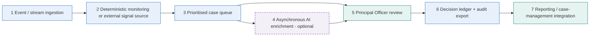

# ARCHITECTURE.md — near-real-time reference design, and what the prototype is

**Status of this document:** the tables below are rendered from [`skills/readiness.py`](skills/readiness.py) by `python3 scripts/render_readiness_docs.py --write`, and `tests/test_readiness.py` fails if they drift. Everything outside the marked blocks is hand-written.

## 1. What the product is

An **AML decision-defensibility and investigation copilot**. Fraud and mule-risk **signals are generated or ingested by other systems** (the institution's transaction monitoring, MuleHunter.AI, the I4C Suspect Registry, RBI DPIP). This application **investigates, prioritises, explains and supports a defensible disposition** by a human Principal Officer, and **records why**.

It does **not** detect fraud, give legal advice, file reports or verify regulatory compliance, and it does not decide: the officer decides. The principle that organises everything: *a detection signal is not a decision — AI proposes, deterministic controls verify, a human Principal Officer decides, and the system records why.* All data in this repository is synthetic.

## 2. The reference flow

```
  external systems                         this application
  ───────────────                          ───────────────────────────────────────────────────────────────────────────
  [1] event / stream          [2] deterministic        [3] prioritised          [4] asynchronous         [5] Principal Officer
      ingestion        ──▶        monitoring or    ──▶     case queue      ──▶     AI enrichment   ──▶      review
      (transactions,              external signal          (priority score,         (optional,               (facts → basis →
       signals)                   source                    evidence quality)        on demand)               AI → decision)
                                                                                                                  │
                                                       [7] external reporting /            [6] decision ledger    ▼
                                                           case-management        ◀──────  (append-only, row-hashed,
                                                           integration                      audit export, write-once copy)
```

* **Fast lane — deterministic, milliseconds to seconds:** stages 1, 2, 3 and 6. Priority scoring, evidence-quality checks, relationship rules, the decision gate and the ledger write are pure functions or single statements. Nothing here waits on a model.
* **Slow lane — on-demand AI, tens of seconds to minutes:** stage 4. Observed 11–120 s per Cortex call in this account (two 120 s timeouts in 19). It is optional, labelled, grounded against the record and fail-closed; the officer can decide without it, and the record then says `AI: NOT_RUN`.
* **Human lane — minutes to days:** stages 5 and 7.

A failure in the slow lane never blocks the fast lane or the officer.



## 3. The stages, and how far each is built

<!-- readiness:architecture:start -->
| # | Stage | Latency class | Status | In this prototype | In production |
|---|---|---|---|---|---|
| 1 | Event / stream ingestion | Deterministic · low latency (milliseconds to seconds) | Prototype simulation | Seed scripts load 19 synthetic alerts and 92 transactions in batch (scripts/setup_alerts.py). | Streaming or micro-batch ingestion (for example Snowpipe Streaming / Kafka) of transactions and signals into partitioned tables, behind masking. |
| 2 | Deterministic monitoring / external signal source | Deterministic · low latency (milliseconds to seconds) | Prototype simulation | The alerts stand in for signals from MuleHunter.AI, the I4C Suspect Registry, RBI DPIP and internal rules. This application detects nothing. | The institution's transaction-monitoring system and external registries raise signals; this application ingests them. |
| 3 | Prioritised case queue | Deterministic · low latency (milliseconds to seconds) | Implemented and demonstrated | Nine-factor deterministic priority score with an explanation, computed on read (skills/prioritisation.py). | The same score computed incrementally at ingest (a dynamic table or stream) and stored, so the queue is a sorted, paged read. |
| 4 | Asynchronous AI enrichment | On-demand AI · slow (observed 11–120 s per Cortex call, two 120 s timeouts in 19) | Prototype simulation | The officer clicks to run the 11-factor assessment; it runs synchronously in the page (40–120 s). Optional, labelled, grounded and fail-closed. | A queued worker (Snowflake tasks / streams) enriches high-priority cases ahead of the officer, stores the result with its model and prompt version, and the officer reads it later. |
| 5 | Principal Officer review | Human · minutes to days | Implemented and demonstrated | Four-zone investigation desk, evidence-quality panel, decision checkpoint and gate (skills/defensibility.py). | The same, with SSO, maker-checker for FILE decisions and case-assignment rules. |
| 6 | Decision ledger | Deterministic · low latency (milliseconds to seconds) | Implemented and demonstrated | Append-only for the application role, row-hashed, with provenance; audit export and write-once packages (skills/ledger.py, skills/audit.py). | The same, plus an independent write-once copy in another account, retention and legal hold. |
| 7 | External reporting / case-management integration | Human · minutes to days | Production requirement | None. Recording FILE stores a decision; filing through FINGate is a separate manual step. No STR is submitted. | An integration to the institution's case-management system and the regulator's reporting channel, with outcomes fed back to the outcome table. |
<!-- readiness:architecture:end -->

## 4. Trust boundaries inside the application

| Layer | Trusted? | What it may do |
|---|---|---|
| Database rows, model output, anything typed | **No** — data, never instructions | Rendered escaped (`esc` / `md_safe` / `label_safe`); parameterised or literal-safe SQL; model output parsed fail-closed |
| The UI | **No** | Shows the gate and enables buttons; **the recorder re-derives** the evidence quality, the gate, the regulatory basis and the AI response from the case record at write time |
| `skills/prioritisation.py`, `evidence_quality.py`, `relationships.py`, `corpus_lifecycle.py` | Pure and deterministic | No model, no database, no clock of their own |
| `skills/feedback.py`, `kpis.py` | Read-only monitoring | Never read by a score, a gate or a prompt (tested) |
| The ledger | Append-only for the application role | `INSERT` + `SELECT` only; row hash; the INSERT stamps `CURRENT_USER()` and `CURRENT_ROLE()` |

Priority and decision are separate in both directions: the priority score is not an input to the decision gate, and nothing in the gate feeds the score.

## 5. Data contracts a production deployment needs

| Feed | In this prototype | Contract for production |
|---|---|---|
| Signals / alerts | Seed tables `ALERTS`, `ALERTS_CURRENT` (19 synthetic rows) | One row per signal: alert id, customer reference, detector rule, source, amount, date, narrative |
| Transactions | `TRANSACTIONS` (92 synthetic rows; 15 alerts have individual rows, 4 only a reconciling summary row) | Individual transfers with counterparty, channel, direction, flag and its source and date |
| Entity attributes | **None** — shared device / address / document links cannot be tested | Rows `(customer_ref, kind ∈ DEVICE / ADDRESS / DOCUMENT, value)` from an identity-resolution / device-intelligence source; `skills/relationships.build_network(attributes=…)` already consumes them |
| Outcomes | Opt-in table `FIU_COPILOT.AUDIT.DECISION_OUTCOMES` ([`deploy/07_decision_outcomes.sql`](deploy/07_decision_outcomes.sql)), not provisioned | Written by a second-line / integration role: QA confirmed or overturned a closure, STR returned for rework, regulator query |
| Identity | Snowflake session identity where the runtime supplies one; otherwise typed and labelled not authenticated | Single sign-on and MFA; no typed path |
| Audit archive | Hash-chained in-Snowflake export (opt-in, not provisioned) and write-once *packages* verifiable offline | A copy in another account under compliance-mode retention ([`skills/audit.py`](skills/audit.py) `WORM_REQUIREMENTS`) |

## 6. Scalability considerations

The prototype reads 31 transaction rows on each page load. At millions of transactions and a large regulatory corpus the shape changes, not the controls:

<!-- readiness:scalability:start -->
| Topic | Prototype today | Approach at scale |
|---|---|---|
| Millions of transactions | 92 rows; the queue reads them all on each load. | Precompute per-alert aggregates (counts, credit / debit totals, flagged share, counterparty keys) at ingest; the queue reads those and the case page reads one alert's rows. Cluster the transaction table by alert and date; never scan it per page load. |
| Priority and evidence-quality scores | Computed in Python on read. | Compute at ingest or on change and store with the policy version. Page the queue and sort in SQL. Re-score only when an input changes. |
| Cross-case relationship links | String match over the other 15 cases in memory. | A counterparty-key index (normalised key → cases) maintained at ingest; link lookups are index reads. Entity resolution replaces string equality before real data. |
| AI enrichment load | One synchronous call per click, 40–120 s. | Queue enrichment for the top-priority cases only; cap concurrency; cache by evidence fingerprint so an unchanged case is not re-run; bound spend with a resource monitor. |
| Regulatory documents | 49 rules in one table; a Cortex Search service over 36. | Partition the corpus by authority and version; keep rule metadata (lifecycle) separate from text; index text for search only; version every rule and keep superseded rules queryable but excluded from conclusions. |
| Ledger and audit export | Reconciliation reads every row. | Reconcile incrementally from the last verified chain head; export per decision or per minute; verify packages in the external store on a schedule. |
<!-- readiness:scalability:end -->

The invariant that must survive scaling: **the gate and the recorder stay synchronous, deterministic and cheap** (they read one case, not the portfolio); everything slow or large moves to precomputed state or to a queue.

## 7. Implemented, simulated and production — by capability

<!-- readiness:capabilities:start -->
### Implemented and demonstrated (13)

Built and exercised by the offline tests and the local run.

| ID | Area | Capability | Evidence | Where | Limits |
|---|---|---|---|---|---|
| POS-1 | Positioning | Stated as an AML decision-defensibility and investigation copilot; signals come from other systems; no detection, legal advice, filing or compliance verification claimed | tests/test_positioning.py | skills/po_copy.py POSITIONING_*, README.md, My cases page | — |
| PRI-1 | Case prioritisation | Transparent 9-factor priority score with a 'why this case is prioritized' explanation, separate from the FILE / NOT_FILE decision | tests/test_prioritisation.py | skills/prioritisation.py, My cases page | The reporting-deadline factor scores only where a suspicion time exists: the optional case-feed field, or a time recorded with an earlier decision. The seeded feed supplies one for 9 of the 19 alerts; the other 10 contribute 0, and the application never infers a time from the alert date. |
| REL-1 | Relationships | Sourced versus inferred links among customer, account, alert, counterparties and related cases; rule-named patterns; untestable link types listed | tests/test_relationships.py | skills/relationships.py, Investigation desk | Shared device / address / document links are tested only when attribute rows exist; the seeded data has none. |
| EQ-1 | Evidence quality | Per-case evidence-quality panel: missing KYC, missing or aggregated history, stale records, contradictions, unavailable documents, unsupported claims, unresolved identity — each with an effect (informational / acknowledgement / manual review / blocks filing) enforced by the decision gate | tests/test_evidence_quality.py, tests/test_gate_extensions.py | skills/evidence_quality.py, skills/defensibility.py, Investigation desk | The effect of each issue is product policy, not a regulatory requirement. Findings read from free text are pattern matches and can never block. |
| COR-1 | Corpus lifecycle | Per-rule source URL, authority, effective date, last reviewed, last independently verified, owner, review SLA, supersession and approval; governance dashboard and report | tests/test_corpus_lifecycle.py | skills/corpus_lifecycle.py, scripts/corpus_governance_report.py, Corpus governance page | No rule is reviewed, approved or independently verified today; the new columns are an opt-in migration and read as NOT PROVISIONED on the live table until it is applied. |
| FB-1 | Feedback loop | Capture of AI acceptance / rejection (derived), override reason and a structured closure reason; monitoring of agreement, override, unsupported-claim, false-positive proxy, rework and recurring evidence gaps; never used for retraining or policy | tests/test_feedback.py, tests/test_gate_extensions.py | skills/feedback.py, Model quality page | Downstream outcomes need an opt-in outcome feed (deploy/07_decision_outcomes.sql); without it they are reported as not available, never inferred. |
| SEC-1 | Security | Decision-maker identity taken from the Snowflake session where one is supplied, labelled as not authenticated where it is typed; the database stamps the writing user and role on every row | tests/test_gate_extensions.py | skills/identity.py, skills/ledger.py, Investigation desk | Whether the hosted runtime supplies st.user, and what CURRENT_USER() returns there, has not been verified in Snowsight. |
| SEC-2 | Security | Approved-model allow-list: a configured Cortex model that is not on the list is refused, not substituted | tests/test_readiness.py | skills/core.py APPROVED_MODELS | — |
| SEC-3 | Security | Prompt minimisation boundary: no customer reference, alert metadata, transaction owner or session identity reaches a model prompt | tests/test_gate_extensions.py | skills/core.py | The KYC profile line and counterparty names are still sent verbatim; with real data they would need pseudonymisation first. |
| AUD-1 | Audit durability | Audit-export protection indicator (provisioned / current / chain valid / external copy attested), write-once packages that chain across exports and verify offline | tests/test_audit_durability.py | skills/audit.py, scripts/audit_ledger.py, Decision archive page | The audit export store is opt-in and NOT provisioned in the live account; the local-directory sink is a simulation of a write-once store. |
| ARC-1 | Architecture | Reference architecture from signal ingestion to reporting integration, with low-latency deterministic stages separated from slow on-demand AI | tests/test_readiness.py | ARCHITECTURE.md, Architecture page | — |
| KPI-1 | KPIs | KPI model with definitions, sources, caveats and a status per KPI; precision / recall / F1 against synthetic labels; a guard against claiming improvement without a baseline; a clearly marked simulated cohort | tests/test_kpis.py | skills/kpis.py, Business value page | Hands-on investigation time and analyst touch time are not measurable from the ledger; no baseline exists, so no improvement is claimed. |
| CORE-1 | Core controls | Fail-closed AI output; evidence grounding; decision-defensibility gate; regulatory-basis governance; append-only ledger with row hash; audit reconstruction | tests/test_fail_closed.py, tests/test_grounding.py, tests/test_defensibility.py, tests/test_regulatory_basis.py, tests/test_ledger.py, tests/test_audit.py | skills/ | Verified live in earlier phases against Snowflake (EVIDENCE.md); not re-run in Phase 14. |

### Prototype simulation (1)

A stand-in is used for the real thing; the stand-in is named.

| ID | Area | Capability | Simulated by | Production replaces it with |
|---|---|---|---|---|
| SIM-1 | Data | Alerts and transactions | 19 synthetic alerts and 92 synthetic transactions seeded in Snowflake, standing in for signals ingested from MuleHunter.AI, the I4C Suspect Registry, RBI DPIP and internal rules | Streaming or micro-batch ingestion of real signals and transactions behind masking and row-access policies; no real PII is loaded here. |

### Production requirement (4)

Not built here. It cannot honestly be simulated; what exists today and what production must add are stated.

| ID | Area | Capability | What production needs |
|---|---|---|---|
| REL-2 | Relationships | Device, address and identity-document graph from an identity-resolution / device-intelligence source | A governed entity-resolution feed (customer ↔ device / address / document attribute rows) and an entity key stronger than a string match. |
| COR-2 | Corpus lifecycle | Independent re-verification of each rule against its live primary source | A named reviewer, other than the owner, checks each PROVEN rule against the live source and records the date. The data model supports it; nobody has done it. |
| FB-2 | Feedback loop | A human-led calibration review that acts on the monitoring (re-weighting a score, changing a prompt) | A documented model-risk process with sampling, sign-off and a version bump. By design, nothing in the prototype does this automatically. |
| AUD-2 | Audit durability | A write-once copy of every export in a separate account (object-lock compliance mode) | See skills/audit.py WORM_REQUIREMENTS. Until it exists, owner-role deletion of never-exported rows is undetectable and the ledger is not immutable. |
<!-- readiness:capabilities:end -->

Security and privacy controls are in [PRODUCTION_READINESS.md](PRODUCTION_READINESS.md); the limits and the roadmap are in [KNOWN_LIMITATIONS.md](KNOWN_LIMITATIONS.md).
