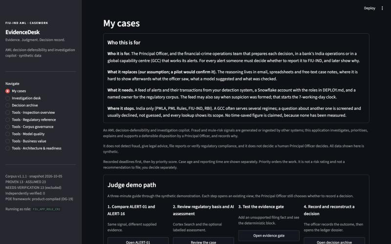
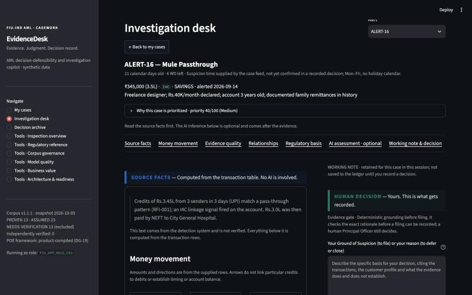
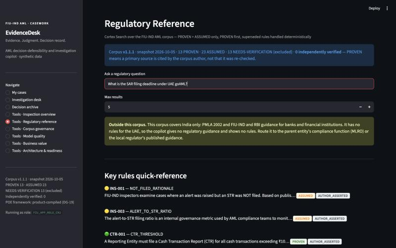
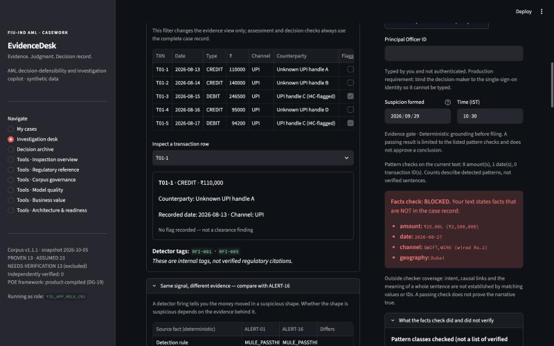

# EvidenceDesk — AML Decision-Defensibility Copilot

**Entry:** Snowflake CoCo CLI Hackathon (GCC Edition), track Risk, Fraud and Regulatory Intelligence Copilot.

**Data:** 100% synthetic. This repository is a prototype and is not a production financial-crime system.

A detector firing is not a decision. EvidenceDesk is the workspace where a Principal Officer decides what happens to an AML alert and can later show why: the facts first, the rule behind them, an optional labelled AI proposal, checks that run on the record and not on the model, and a decision record that can be reconstructed.

## Who this is for

**Who it is for.** The Principal Officer, and the financial-crime operations team that prepares each decision, in a bank's India operations or in a global capability centre (GCC) that works its alerts. For every alert someone must decide whether to report it to FIU-IND, and later show why.

**What it replaces (our assumption; a pilot would confirm it).** The reasoning lives in email, spreadsheets and free-text case notes, where it is hard to show afterwards what the officer saw, what a model suggested and what was checked.

**What it needs.** A feed of alerts and their transactions from your detection system, a Snowflake account with the roles in DEPLOY.md, and a named owner for the regulatory corpus. The feed may also say when suspicion was formed; that starts the 7-working-day clock.

**Where it stops.** India only (PMLA, PML Rules, FIU-IND, RBI). A GCC often serves several regimes; a question about another one is screened and usually declined, not guessed, and every lookup shows its scope. No time-saved figure is claimed, because none has been measured.

## Purpose

An AML decision-defensibility and investigation copilot. Fraud and mule-risk signals are generated or ingested by other systems; this application investigates, prioritises, explains and supports a defensible disposition by a Principal Officer, and records why.

It does not detect fraud, give legal advice, file reports or verify regulatory compliance, and it does not decide: a human Principal Officer decides. All data shown here is synthetic.

Signal from another system → prioritised case → evidence and regulatory basis → optional AI proposal → Principal Officer decision → decision record.

**A detection signal is not a decision.** AI may propose; deterministic controls validate checkable facts; an authorised human decides and records the rationale.

## See it

The screens below are the real application running against the clean-room Snowflake environment (synthetic data, 5 October 2026).

| | |
|---|---|
|  |  |
| **My cases.** Who it is for, what it replaces and needs, then the queue with deadlines from the case feed. | **Investigation desk.** The same ₹3.45 lakh pass-through signal as ALERT-01, opened on the source facts, not on an AI answer. |
|  |  |
| **Scope guard.** A question about another jurisdiction is declined and routed to the parent entity's compliance function. | **Evidence gate.** A planted sentence about a ₹25 lakh SWIFT transfer to Dubai is named fact by fact and blocks the filing. |

## What is checked, and how well

Every figure was produced on 5 or 6 October 2026 by a command listed in this repository, on synthetic data. The author wrote the alerts, the validators and the labels, so these are regression and calibration records, not independent benchmarks. Where a set was used to build a fix, the table says so and quotes the first measurement.

| What | Result | Evidence |
|---|---|---|
| Offline test suite | 605 passed. The 20 live tests are skipped without Snowflake credentials, and deselected by `-m "not live"`. Run on Python 3.11 and 3.14 with the versions in `constraints.txt`, and with Streamlit 1.61.0, the lowest version the requirements allow. One UI test fails on Streamlit 1.56 to 1.60, so those are excluded | `pip install -r requirements.txt -c constraints.txt` then `python -m pytest tests -q -m "not live"` |
| Live suites on the redeployed clean room (Snowflake, Cortex), 6 October | First run: owner role 18 passed, 1 skipped, 1 failed; app role 17 passed, 1 skipped, 1 failed. The one failure in each was a stale constant (the earlier 16-alert label counts) in a seeding test. **Full re-run after the correction: owner role 19 passed, 1 skipped; app role 18 passed, 1 skipped, 1 deselected; no failures.** The skipped test needs the optional deletion witness, which is not provisioned. Clean-room database only; the production database and Snowsight rendering were not covered | `evidence/cleanroom-2026-10-06/live_suites.log` (first run, kept unchanged) and `live_suites_rerun.log` |
| Least privilege: app role cannot update, delete or read the answer key | RBAC proof `overall = PASS`; ledger privileges exactly INSERT, SELECT; answer key unreadable, 0 grants | `deploy/04_verify_ledger_rbac.sql` |
| Hosted app matches the source | 30 of 30 code files byte-identical after the redeploy on 6 October, with the saved responses included; health 10 healthy, 0 unavailable, 3 unverified (deletion witness, one billed model call, one billed Analyst call). Two deployed files have changed since, `skills/readiness.py` (limitation text) and `streamlit_app.py` (the layout of the demo-path buttons), so the hosted copy matches the source again only after the next redeploy. What Snowsight renders is still not verified | `evidence/cleanroom-2026-10-06/live_suites.log` |
| Regulatory lookup, calibration set (thresholds were set on it) | 22 of 22 off-scope refused; 20 of 20 answerable answered (6 October, 98 queries across all sets, none served by the keyword fallback) | `evidence/retrieval-gold/2026-10-06/` |
| Regulatory lookup, holdout written after the generic foreign-regime screen was built, measured once | **11 of 12 off-scope refused**, 8 of 8 answerable answered; the one miss is a question about the Cayman Islands. The earlier holdouts are regression records: 4 of 6 off-scope refused on 5 October before the screen existed, 6 of 6 after it (the screen was built after seeing the two misses) | `evidence/retrieval-gold/2026-10-05/holdout3_first_measurement/` and `evidence/retrieval-gold/2026-10-06/` |
| Evidence gate, faithful narratives wrongly blocked | 0 of 70 (ALERT-01), 0 of 69 (the other 14 alerts with real rows; re-run on 6 October after the three Gulf-remittance alerts were added, which the validator was never tuned on) | `evidence/fabrication-benchmark/2026-10-06/` |
| Evidence gate, unseen fabrication phrasings (the figure to quote) | 30 of 38, 78.9% (95% interval 63.6 to 88.9); 27 of 38 before the last round of pattern fixes | `evidence/fabrication-benchmark/2026-10-05/` (the frozen baselines are there; the 6 October run reproduces 30 of 38) |
| Mis-attribution check (every fact real, wrongly bound), first measurement on a fresh set | 14 of 20, 70.0% (95% interval 48.1 to 85.5); 1 of 20 correct statements wrongly flagged | `evidence/fabrication-benchmark/2026-10-05/attribution_q_first_measurement.json` |
| Which model to use (three models, 16 alerts, assessment only, one run each) | `claude-sonnet-4-5` recommended FILE on all 16 alerts, including the 3 labelled NOT_FILE; `llama3.1-8b` declined FILE on all 3 NOT_FILE but also on 2 of 9 FILE-labelled; `llama3.3-70b` is the only one whose recommendation differs between the groups (FILE on 8 of 9 FILE-labelled, declined 2 of 3 NOT_FILE) and is the slowest (median 59 s). Kept as the default. The structured-output on/off comparison was contaminated by one fallback answer, so no latency benefit is claimed | `evidence/live-replay/MODEL_COMPARISON_2026-10-06.md` |
| Validator against a model as the checker (160 cases; first run for each) | Fabrications caught: validator 65 of 80; `llama3.3-70b` 76 of 80; `claude-sonnet-4-5` 80 of 80. Faithful narratives wrongly flagged: validator 0 of 40; `llama3.3-70b` 39 of 40; `claude-sonnet-4-5` 15 of 40. The gate stays deterministic | `evidence/llm-checker/2026-10-06/` |
| **Held-out** Gulf-remittance alerts, first measurement (3 alerts written after the nexus rule was frozen, prediction written first, though the commit order that showed it no longer exists) | **A miss.** The FILE-labelled alert was recommended FILE. Both NOT_FILE-labelled alerts were also recommended FILE: the model's Geography factor stood on a UAE corridor (the product keeps no jurisdiction list) and the complexity test treats any SWIFT row as a cross-border hop. Every fact was grounded; the rule was deliberately not changed | `evidence/heldout-gcc/2026-10-06/` |
| Real model over all 19 alerts (two runs combined; the full run lost three alerts and two drafts to Cortex timeouts, and a retry covered them) | 19 of 19 assessments valid; 138 factors triggered, 130 supported by the record; 19 drafts, all passed the hard evidence gate (18 first time, 1 after the one-shot repair), 0 unsupported facts. Against the author's labels: FILE-labelled alerts got FILE 8 of 10; the legitimate twin (ALERT-16) got REVIEW after the record check discounted two factors the model had triggered; **3 of 5 NOT_FILE-labelled alerts still got FILE**, two of them the held-out Gulf-remittance alerts. The same record check also moved a FILE-labelled alert (ALERT-04) to REVIEW. Median 78 s per assessment (max 116 s) | `evidence/live-replay/2026-10-06/COMBINED.md` |

The in-distribution catch rate (154 of 154) is deliberately not in this table: the same author wrote the validator and the narratives, so it shows only that the validator keeps catching what it was built to catch. The first stress set caught 7 of 40 before the validator was widened.

### Not claimed

- **Legal accuracy.** No rule in the corpus has been independently verified (0 of 49). PROVEN means a primary source is cited by the corpus author. On 5 October two rules (SB-003, STR-004) were found citing a PMLA section as the tipping-off provision when that section is "Access to information". They are re-sourced to the PML Rules and downgraded to ASSUMED, and the correction is kept in the corpus.
- **Accuracy on real cases, volumes, or time saved.** The data is synthetic and the labels are one author's. No hands-on timing exists.
- **A rendered Snowsight session.** The hosted clean-room app was byte-identical to the source at the 6 October redeploy, but what Snowsight shows, and what `st.user` returns there, has not been observed.
- **Cortex Code CLI.** The repository carries five Cortex Code CLI skill files in [`.cortex/skills/`](.cortex/skills/), kept consistent with the scripts they name by a test. No Cortex Code CLI session is recorded, so none is claimed ([`evidence/coco/`](evidence/coco/README.md) says how one would be). The code was written with an AI coding assistant (Claude Code).
- **A buyer, a price, or why a global capability centre.** Who would pay, and how, is an assumption (A5 in the claim audit, and a labelled section in the writeup). Nobody has been asked.
- **Production readiness.** No penetration test and no row-access policy. Two decisions written at the same moment on one alert cannot be prevented here (the ledger is append-only and uniqueness is not enforced on this account); they are detected and reported as `CONCURRENT_DECISIONS`. Column masking exists as an opt-in script and was checked only in the isolated environment. See [SECURITY.md](SECURITY.md).

## What it does not do

- It does not autonomously detect all fraud, make legal determinations, file regulatory reports, or replace a Principal Officer.
- It does not claim that the included regulatory corpus has been independently verified.
- It must not be loaded with real customer data without the enterprise controls described in [SECURITY.md](SECURITY.md).

## How it works

`Alert and transaction data` → `Snowflake data layer` → `governed regulatory retrieval` → `optional AI assessment/draft` → `deterministic evidence and decision controls` → `Principal Officer workspace` → `decision ledger`

| Snowflake capability | Used for |
|---|---|
| Streamlit in Snowflake | The investigator workspace, deployed by the app role |
| Cortex Search | Governed retrieval over the regulatory corpus (PROVEN and ASSUMED rules only), with a scope guard that declines out-of-perimeter and weakly related questions |
| Cortex Complete | The optional 11-factor assessment and the draft narrative, each labelled as a proposal and re-checked deterministically |
| Cortex Analyst | Natural-language questions over the semantic model |
| Roles and grants | The app role can insert into and read the append-only ledger and nothing more; the answer key is not readable by it |

What the deterministic layer does, and the model never does: ground every cited amount, date, identifier, entity, channel and place against the case record (hard block), flag facts bound to the wrong party (acknowledge), score and order cases by published factors, assess the quality of the case record, enforce a seven-row decision checkpoint again at write time, and hash each ledger row with its provenance.

A reviewer who would rather not wait for a model can press **Load the saved assessment (no wait)** where it is offered. It is a real model reply captured earlier, matched to the case by the exact prompt text; the screen says so, every check runs again now, and the ledger row records that the output was a saved response.

## Judge demo path

The **My cases** page provides a four-step guide:

1. Compare `ALERT-01` and `ALERT-16`: the same detector signal, different evidence, different defensible outcomes.
2. Review the regulatory basis and the optional AI assessment, which stays labelled as a proposal. Underneath it, the app shows what argues against the leading call.
3. Add an unsupported fact to the `ALERT-01` filing rationale and watch the evidence gate block the filing.
4. Record a Principal Officer decision (clean room only), then open its reconstruction. Nothing is submitted to FIU-IND.


## Run, validate, reproduce

```bash
python3 -m venv .venv && source .venv/bin/activate && pip install -r requirements.txt -c constraints.txt   # constraints.txt = the exact versions the suite was run on
python -m py_compile streamlit_app.py skills/*.py scripts/*.py tests/*.py
python -m pytest tests -q -m "not live" -p no:cacheprovider        # offline gate. -m "not live" matters: with credentials in .env a plain pytest also runs the live tests against that database
python scripts/eval_fabrication_benchmark.py --write                # evidence gate benchmark (offline)
python scripts/deploy_snowflake.py --profile cleanroom --suffix CR2 # PLAN of an isolated clean-room deploy; add --apply to execute
python scripts/eval_retrieval_gold.py --write                       # live retrieval evaluation (needs credentials, app role)
python scripts/deploy_snowflake.py --profile cleanroom --suffix CR2 --apply --step replay   # the real model over every alert
python scripts/verify_dossier.py docs/sample/decision-pack-sample.json   # check an inspection pack offline: no Snowflake, no application (the sample was built by the real recorder against a stub database, not from a hosted decision)
python scripts/load_feed.py --alerts domain/feeds/canonical_alerts.csv --transactions domain/feeds/canonical_transactions.csv   # DRY RUN of a case feed against the contract
python scripts/eval_llm_checker.py --offline                        # the deterministic validator on the head-to-head cases (a model-as-checker arm needs credentials)
```

Use only a non-production Snowflake environment that you are authorised to access, with credentials in `.env` or managed secret storage and never in Git. See [DEPLOY.md](DEPLOY.md). To run the app locally: `cp .env.example .env`, then `streamlit run streamlit_app.py`.

The test suite is the behavioural source of truth. Documentation explains intended use and safety boundaries; it does not override code, tests, database grants, or approved enterprise policy.

## Documentation

- [DEPLOY.md](DEPLOY.md): minimal safe setup and deployment guidance.
- [SECURITY.md](SECURITY.md): prototype security boundaries and production requirements.
- [EVIDENCE.md](EVIDENCE.md): validation approach and evidence limits.
- [ARCHITECTURE.md](ARCHITECTURE.md), [KNOWN_LIMITATIONS.md](KNOWN_LIMITATIONS.md) and [PRODUCTION_READINESS.md](PRODUCTION_READINESS.md): what is implemented, simulated or only required for production, rendered from `skills/readiness.py` so a document cannot say more than the code does.
- [DEMO_RUNBOOK.md](DEMO_RUNBOOK.md): the three-minute demo, the fallbacks and the judge questions.
- [HANDOFF.md](HANDOFF.md): contributor handoff and release checklist.
- [docs/DATA_CONTRACT.md](docs/DATA_CONTRACT.md): the alert and transaction feed an institution supplies, and what the loader refuses.
- [docs/PILOT_PROTOCOL.md](docs/PILOT_PROTOCOL.md): how a pilot would measure what this prototype does not claim.
- [docs/submission/WRITEUP.md](docs/submission/WRITEUP.md) and [docs/submission/CLAIM_AUDIT.md](docs/submission/CLAIM_AUDIT.md): the submission writeup, and every headline claim labelled PROVEN, STUBBED or ASSUMED with its evidence.

## License

[MIT](LICENSE), copyright 2026 Nikhil Pande. The licence covers this repository's code and documents. The regulations and guidance the corpus cites remain the property of their publishers. This repository does not give legal advice.
